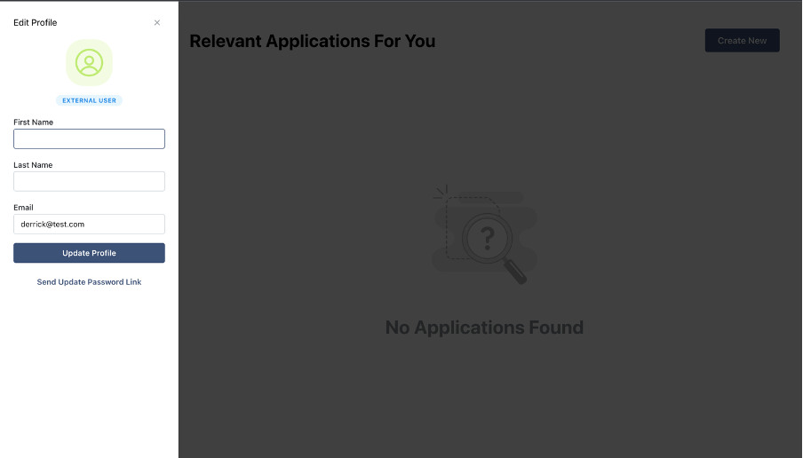

# CP QUOKKA README

## Project Overview

The Colon Cancer Family Registry (CCFR) Cohort is an international consortium of six institutes across Northern America and Australasia, formed as a resource to support studies on the aetiology, prevention, and clinical management of colorectal cancer. The strength of the CCFR is enhanced by remaining engaged with the scientific community. This project involves developing a web-based project management application to process incoming collaboration requests from external researchers. The application will automate existing manual tasks and workflows providing a streamlined user-friendly system.
The application will facilitate growth in collaboration requests and ease workloads of CCFR staff. The application will centralise all components of collaboration request management providing a holistic and entirely integrated system for the requestor and CCFR team. The application will include the following features:

- Researcher registration portal allowing researchers to save and return to incomplete applications.

- Replace existing paper-based request forms with web-based forms.

- Automated tracking system.

- Automated workflows and task assignment.

- Notification feature that sends emails to CCFR team and researchers.

## Authors
- [Irgio Basrewan](https://github.com/irgiob) - Scrum Master
- [Dimitri Sadikin](https://github.com/dimitrisad) - Design Lead
- [Navdeep Beniwal](https://github.com/navdeepbeniwal16) - Solution Architect
- [Mohammad Saood Abbasi](https://github.com/MohammadSaoodAbbasi) - Product Owner
- [Michael Hannon](https://github.com/mhannon11) - Quality Assurance Manager

## Product Feature
- Login functionality alongside authentication
- Create Application 
  - Save and Submit Application
- Submit BWG Form
- Automated tracking system for the applications
- Voting capabilities to approve or reject applications
- Navigation bar that allows user to view their applications and for admin to view all applications and users
  - Admin can also filter accouns depending on their role and applications depending on their status
  - Search bar for accounts
- Edit Profile 
  - Editted profile will display different icons compared to accounts which have not registered their first and last name
- Notification feature that sends emails to CCFR team and researchers.
- Different roles contatining different privileges within the system

## Our Product

*Login Page*


*Creating a new application*


*Tracking an application*


*Submit a BWG Form*


*Application Voting in Progress*


*Admin User Management*


*Edit Profile*

## Tech Stack

**Application Development Platform:** Firebase

**Front End Framework:** React.js, Next.js, Mantine

**Back End Framework:** Node.js, next-firebase-auth, Axios

**Email Service Engine:** Nodemailer

**Deployment Platform:** Vercel

**Quality Assurance:** Jest, Babel, React Testing Library

**Scheduling:** Cron Jobs

**Coding Standard Enforcement:** ESlint, Prettier


## Running on Development
Set up instructions
```bash
  npm install
```

On the off chance that an error occur when trying to install npm, try running:
```bash
npm install -legacy-peer-deps
```
The instruction above will install the dependencies for the libraries used for this project

To run this project on your local machine:

```bash
  npm run dev
```
or 

```bash
  npm build
```
Followed by (only necessary when using "npm build")
```bash
  npm start
```
For testing, run:

```bash
  npm test
```


Please refer to the following user profile to test several functionalities including authentication:


| User              | Password             |
| ----------------- | -------------------- |
| derrick@test.com | password              |